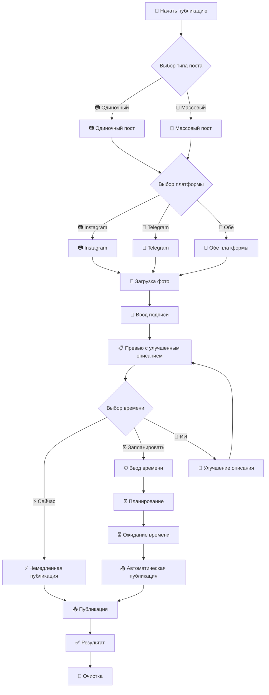

# Новый бизнес-процесс публикации постов

## Описание процесса

Реализован улучшенный бизнес-процесс для автоматической публикации постов в социальных сетях с пошаговым интерфейсом и планированием.

## Этапы процесса

### 1. Инициация процесса
- Пользователь нажимает кнопку "🚀 Начать публикацию"
- Система очищает предыдущее состояние
- Переход к выбору типа поста

### 2. Выбор типа загрузки
- **📷 Одиночный пост** - одно фото
- **📸 Массовый пост** - несколько фото (до 10)
- Переход к выбору платформы

### 3. Выбор социальной сети
- **📷 Instagram** - только Instagram
- **💬 Telegram** - только Telegram группа
- **🔀 Обе платформы** - Instagram + Telegram
- Переход к загрузке фото

### 4. Загрузка фото
- Для одиночного поста: одно фото
- Для массового поста: до 10 фото
- Автоматическая валидация и обработка
- Переход к вводу подписи

### 5. Ввод подписи
- Пользователь отправляет текстовое сообщение
- Система показывает превью поста
- Переход к выбору времени публикации

### 6. Выбор времени публикации
- **⚡ Опубликовать сейчас** - немедленная публикация
- **⏰ Запланировать** - отложенная публикация
- **🤖 Помощь ИИ** - улучшение описания с помощью ИИ

### 7. Планирование (если выбрано)
- Ввод времени в различных форматах:
  - `HH:MM` - сегодня в указанное время
  - `DD.MM HH:MM` - в указанную дату и время
  - `+N` - через N минут
- Подтверждение планирования

### 8. Публикация
- Обработка фото (изменение размера, форматирование)
- Публикация в выбранные платформы
- Уведомление о результате
- Очистка временных файлов

## Диаграмма процесса



## Новые возможности

### 1. Пошаговый интерфейс
- Четкие этапы с понятными инструкциями
- Валидация на каждом шаге
- Возможность отмены в любой момент

### 2. Планирование публикации
- Гибкие форматы ввода времени
- Автоматическая публикация в указанное время
- Возможность отмены запланированных постов

### 3. Улучшенный статус
- Отображение текущего этапа процесса
- Информация о запланированных постах
- Статус подключений к платформам

### 4. ИИ помощь
- Улучшение описаний постов с помощью Google AI Studio
- Адаптация стиля под выбранную платформу
- Автоматическое добавление эмодзи и хештегов
- Интеграция с Google Gemini API

### 5. Обработка ошибок
- Валидация на каждом этапе
- Информативные сообщения об ошибках
- Автоматическая очистка при ошибках

## Команды управления

- `/start` - запуск бота
- `/help` - помощь с новым процессом
- `/status` - статус бота и текущий этап
- `/cancel` - отмена текущего процесса и запланированных постов

## Технические особенности

- Состояние пользователя отслеживается на каждом этапе
- Асинхронное планирование с использованием asyncio
- Автоматическая очистка временных файлов
- Поддержка отмены запланированных постов
- Логирование всех операций
- Интеграция с Google AI Studio для улучшения текстов

## Настройка ИИ

Для использования функции "Помощь ИИ" необходимо:

1. Получить API ключ от Google AI Studio: https://aistudio.google.com/api-keys
2. Добавить ключ в файл `.env`:
   ```
   GOOGLE_API_KEY=your_api_key_here
   ```
3. Перезапустить бота

ИИ сервис автоматически:
- Улучшает описания постов
- Добавляет подходящие эмодзи
- Создает релевантные хештеги для Instagram
- Адаптирует стиль под выбранную платформу
